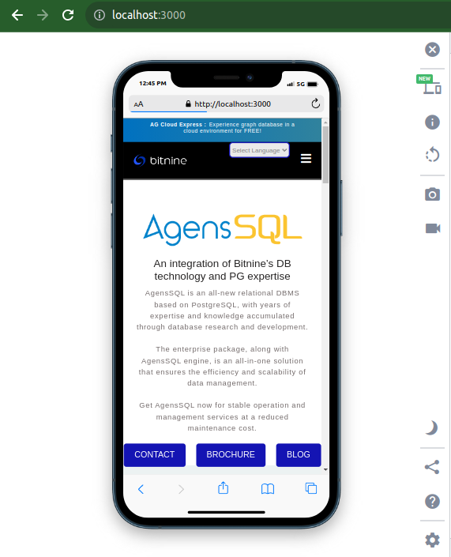

# Bitnine Homepage clone

This project is a Coding Test Problem for 2023 Apache AGE Internship Program (Kenya)

### Problem Task:

Design a webpage similar to the Bitnine's official website https://bitnine.net/

### Clone Overview

### Live Demo

https://bitnine-clone-react.netlify.app/

> Please note that you will have to create a simple account and then login to access the page. The process is very simple and takes less than a minute.

### Authentication Backend Repository

https://github.com/wamae-ndiritu/bitnine-clone/tree/auth

### Aim of the project

The project aims at demontrating frontend skills by replicating an existing frontend design. Since the application also requires to handle some authentication so that the user can access the content, it also plays a major role at demontrating backend and database skills.

### App Architecture

- The application has 3 pages:
  - Register Page
  - Login Page
  - Home Page
- To access the `Home Page`, you must be authorized and therefore you'll need to create an account and then login.

### Frontend Technology

- React `18.2.0`
- State Management: `context API`
- Sass `1.65.1` to compile `.scss` stylessheets
- Bootsrap `5.3.1`
- Custom `CSS`
